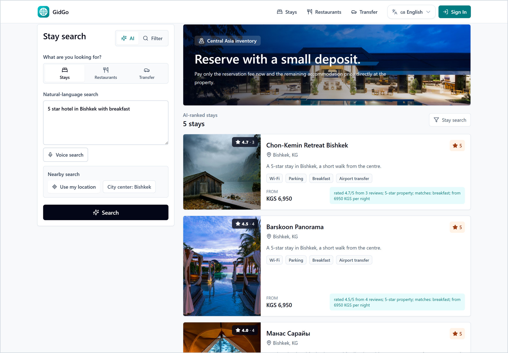
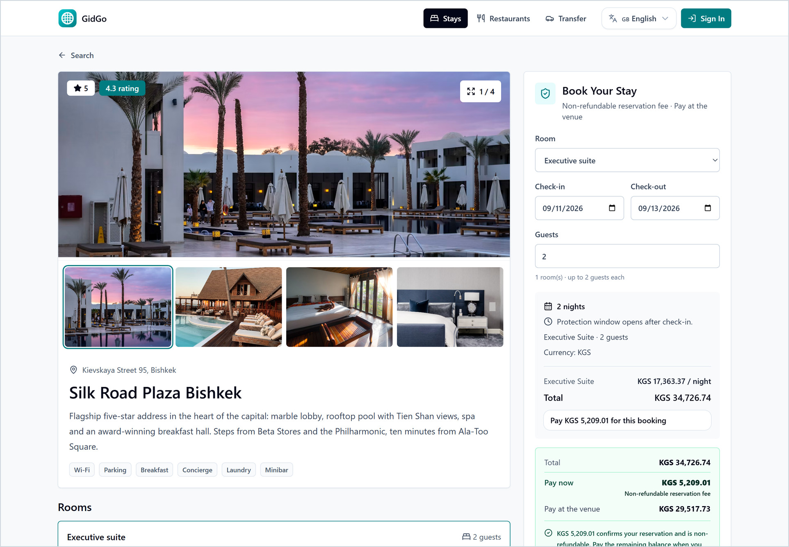
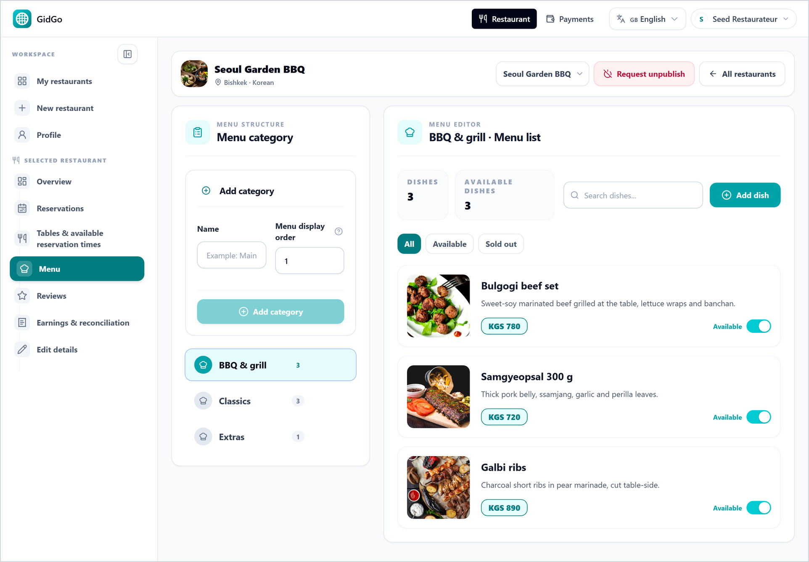
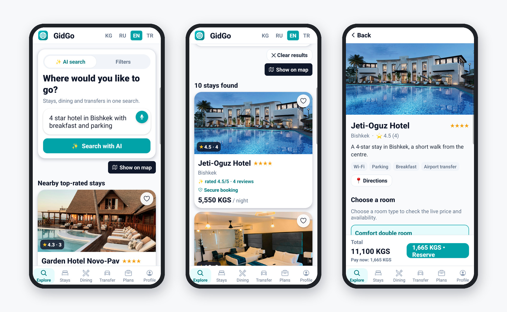
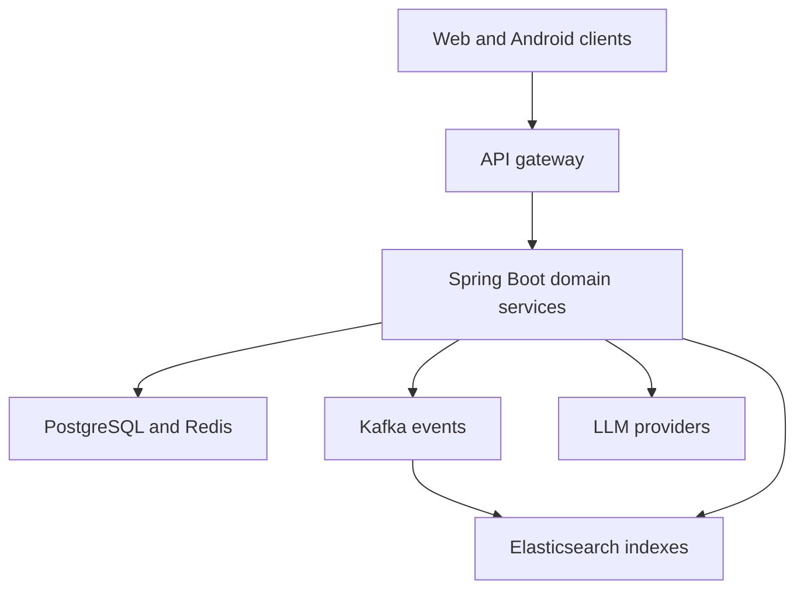

# Gidgo — engineering case study

**Java backend · Event-driven workflows · Multilingual search · AI/LLM integration**

Gidgo is an independently developed travel marketplace connecting travellers with hotels, restaurants and transfer operators. The product brings customer-facing web and Android experiences together with business and administration panels.

**My role:** founder and developer, working across backend architecture, product workflows, web/mobile integration, testing and delivery.

This repository is a **public engineering overview**, not the application source. Gidgo remains a private commercial product.

**[Open the live web demo →](https://demo.gidgo.net)** · [Android test build (APK)](https://demo.gidgo.net/app) · [Contact the developer](mailto:narman.roglu@gmail.com)

## See the product

**Natural-language search.** A plain request becomes structured filters — city, star class, amenities. The search index returns the listings, and each result states why it matched.

<table>
  <tr>
    <td width="50%" valign="top">
      
      
<strong>Booking with a deposit.</strong> Room, dates and a clear cost breakdown: only the reservation fee is paid online; the balance is paid at the property.

    </td>
    <td width="50%" valign="top">
      
      
<strong>Operator console.</strong> Businesses manage their own catalogue — here menu categories, prices and dish availability, shown with a seeded demo operator.

    </td>
  </tr>
</table>

**Android app, version 1.30.2** — request → AI-ranked results → room selected, with the total and the amount paid now. Captured on a physical Samsung phone and set in simple frames; only the system status and navigation bars are cropped.

*Real application screens, captured in September 2026 using demo listings. Names, images, ratings and prices illustrate the product; they are not evidence of commercial partnerships or live booking availability.*

### A three-minute walkthrough

1. Open the [web demo](https://demo.gidgo.net) and try **“5 star hotel in Bishkek with breakfast”**. Compare the returned listings with the request.
2. Open a hotel to inspect rooms, amenities and the reservation price breakdown. Switch the interface language to explore the multilingual experience.
3. Optionally try the [Android test build](https://demo.gidgo.net/app). This is a direct APK download, not a Google Play listing; the browser demo is sufficient for an initial review.

Public search and listing pages can be explored without signing in. There is no need to submit a booking or enter personal/payment information for this walkthrough. Business-panel access can be demonstrated on request; credentials are not published here. This is a development demo, so data and availability may change.

## At a glance

| Area | Technologies and scope |
| --- | --- |
| Backend | Java 21, Spring Boot, Spring Security, REST APIs |
| Data and events | PostgreSQL, JPA/Hibernate, Flyway, Kafka, Redis |
| Search and AI | Elasticsearch, multilingual query interpretation, LLM APIs, structured outputs, translation workflows |
| Web and mobile | React, Next.js, TypeScript, React Native / Expo, Android |
| Quality and delivery | JUnit, Mockito, Testcontainers, Docker, GitHub Actions, Linux/VPS delivery |

## Product workflows

- Hotel discovery and reservations.
- Restaurant discovery, reservations and food-order workflows.
- Transfer discovery and booking, with operator and driver workflows.
- Business panels for managing inventory and operational activity.
- Authentication and account lifecycle, including Google sign-in, passkeys and TOTP.
- Multilingual interfaces, natural-language search and content translation.

## Architecture, simplified

This diagram shows responsibilities and data flow, not deployment topology or private infrastructure details.

## Engineering decisions worth discussing

### 1. Reliable business workflows

Reservations, cancellations and payment-related operations need predictable behaviour under retries and concurrent updates. Work in this area includes idempotency, transaction boundaries, durable event delivery and PostgreSQL-backed integration tests.

**Trade-off:** independently deployed services require explicit handling of partial failures and eventual consistency. More services do not automatically make a system more reliable.

### 2. AI-assisted search with deterministic constraints

Natural-language requests are interpreted into structured filters, then executed against the search index. Explicit geography, prices and other user constraints must not be silently replaced by model guesses. Straightforward requests can use a rule-based path; ambiguous requests can use an LLM with output validation and fallback behaviour.

**Trade-off:** LLM flexibility is useful, but correctness, latency and provider availability still need ordinary backend engineering. The focus is structured query interpretation and relevant catalog retrieval.

### 3. Multilingual retrieval and translation

Search work includes Cyrillic/Latin variants, spelling tolerance and geographic filtering. Translation work includes structured responses, batching, provider limits and checks on model-generated content. Search interpretation and content translation are separate responsibilities.

**Trade-off:** a successful API response does not establish translation quality or search relevance. Representative multilingual examples and regression tests are needed.

### 4. End-to-end delivery

Backend changes are considered alongside customer screens, business panels and Android behaviour. The workflow includes focused automated tests, pull requests, CI and release verification. AI coding agents assist development; their output still needs review and validation.

## A useful technical walkthrough

For an interview, the most informative discussion would follow a request from the interface through authentication, domain logic, persistence, events and search. Example topics:

- What prevents a retried request from causing a duplicate operation?
- What happens when cancellation races with another status update?
- How does search behave when the LLM is unavailable or suggests the wrong city?
- How are multilingual outputs checked, and what remains uncertain?

A product walkthrough or selected technical discussion can be arranged without distributing the private source repository. This public summary focuses on engineering practice rather than private business metrics.

## О проекте

Gidgo — независимый продукт для поиска и бронирования отелей, ресторанов и трансферов. Мой основной фокус — Java/Spring Boot backend, надёжность бизнес-процессов, Elasticsearch и интеграция LLM; также работаю с web, Android, тестированием и выпуском версий. Здесь опубликован только обзор инженерных решений. Исходный код коммерческого продукта остаётся закрытым.

## Proje hakkında

Gidgo; otel, restoran ve transfer arama ve rezervasyon süreçlerini birleştiren bağımsız bir üründür. Ana odağım Java/Spring Boot backend, iş süreçlerinin güvenilirliği, Elasticsearch ve LLM entegrasyonudur; web, Android, test ve yayınlama taraflarında da çalışıyorum. Bu depo yalnızca mühendislik tanıtımıdır; ticari ürünün kaynak kodu private kalır.

---

[Developer profile — Nariman](https://github.com/izzet2002) · Public overview updated September 2026
